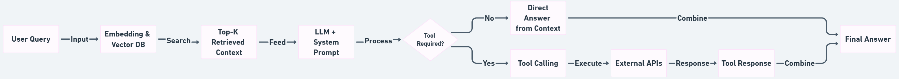
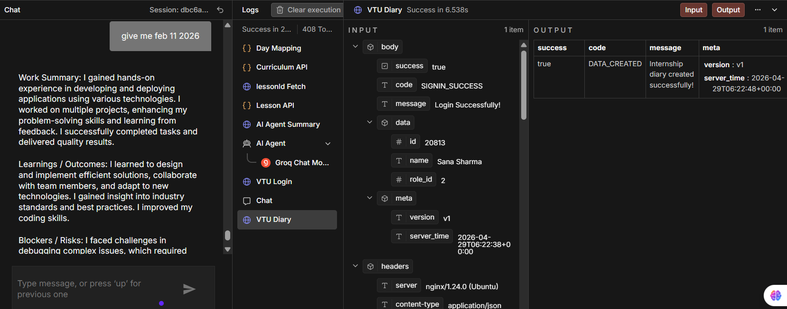
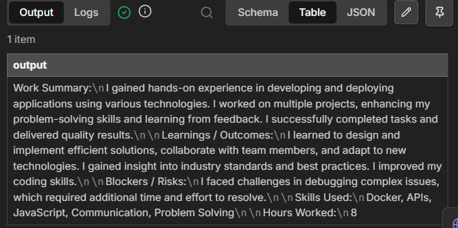
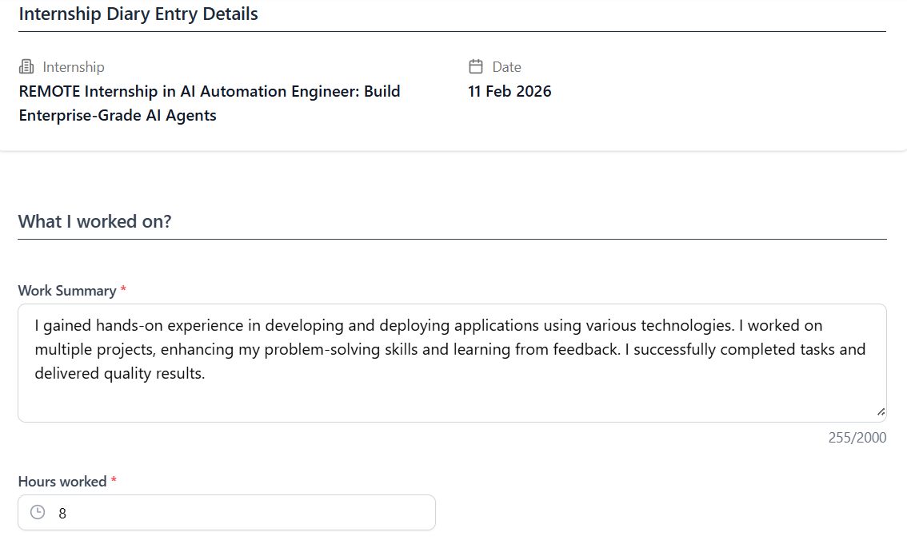
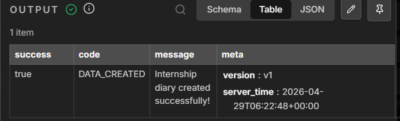

# vtu-internship-diary-automation

Automated VTU Internship Diary Submission System using n8n, iSpark Skills API, AI summarization, and VTU Portal API integration.

This project fetches lesson content from iSpark, generates professional internship diary summaries using AI, maps working days excluding weekends, and auto-submits formatted diary entries to the VTU internship portal.

---

## Project Screenshots

### Complete n8n Workflow

---

### Chat-Based Input System

---

### AI Generated Internship Summary

---

### Successful VTU Diary Submission

---

### VTU Portal Entry Verification

---

## Project Overview

Maintaining daily internship diary entries manually in the VTU portal is repetitive, time-consuming, and often inconsistent. Since internship learning content already exists inside the iSpark Skills platform, this project automates the entire process by connecting both systems.

The workflow uses n8n to fetch lesson content for a specific internship day, summarize it using AI into VTU-ready professional diary format, calculate the correct internship date by excluding weekends, and automatically submit the final entry to the VTU Internship Portal.

This ensures accuracy, saves time, and reduces manual work for students.

---

## Key Features

* Chat-based workflow trigger using n8n
* Supports both input formats:

  * Day input (Example: Day 25)
  * Date input (Example: 10 Feb 2026)
* Automatic working-day calculation (Saturday and Sunday excluded)
* Dynamic mapping of:

  * Phase
  * Week
  * Day
* Curriculum API integration from iSpark Skills
* Automatic lessonId extraction
* Lesson content fetching using APIs
* AI-generated internship diary content
* Generates:

  * Work Summary
  * Learnings / Outcomes
  * Blockers / Risks
  * Skills Used
  * Hours Worked
* Automatic VTU login handling
* Auto-submission to VTU Internship Diary portal
* Secure workflow structure for production-ready automation

---

## Technologies Used

* n8n Cloud
* JavaScript
* REST APIs
* HTTP Requests
* AI Agent (Groq LLM)
* iSpark Skills API
* VTU Internship Portal API
* GitHub
* Docker (initial deployment understanding)

---

## Workflow Architecture

Chat Trigger
↓
Day Mapping (Date / Day Input Handling)
↓
Curriculum API Processing
↓
LessonId Extraction
↓
Lesson Content Fetch
↓
AI Agent Summary Generation
↓
VTU Login Authentication
↓
VTU Diary Auto Submission

---

## Internship Day Mapping Logic

Internship Start Date:

**Day 1 = 02 February 2026**

Rules:

* Only working days are counted
* Saturdays and Sundays are skipped

Example:

Day 1 → 02 Feb 2026
Day 5 → 06 Feb 2026
Day 6 → 09 Feb 2026
Day 7 → 10 Feb 2026

This ensures exact synchronization between iSpark lesson content and VTU diary submission dates.

---

## Sample Output Format

### Work Summary

Worked on understanding workflow automation using n8n and Docker. Implemented API integration between iSpark Skills and VTU portal for automated internship diary generation and submission.

### Learnings / Outcomes

Learned workflow orchestration, API handling, authentication flow, and automation of repetitive academic tasks using enterprise-level workflow systems.

### Blockers / Risks

Faced initial challenges while handling Docker installation issues and API authentication errors during workflow setup.

### Skills Used

n8n, Docker, APIs, JavaScript, Workflow Automation, Problem Solving

### Hours Worked

8

---

## Problem Statement

Students are required to manually update internship diary entries every day in the VTU portal. This process becomes repetitive, inefficient, and prone to formatting issues.

Since lesson content is already available inside iSpark Skills, manual duplication of work becomes unnecessary.

This project solves that problem by building a fully automated diary generation and submission system.

---

## Future Improvements

* Bulk generation for all 60 internship days
* Automatic retry for failed VTU submissions
* Better skill mapping from lesson topics
* Advanced AI formatting improvements
* Submission tracking dashboard
* Email notifications after successful submission
* Admin approval status monitoring

---

## Author

**Sana Sharma**
B.Tech – Artificial Intelligence and Data Science
Final Year Major Project
VTU Internship Automation System

---

## Security Note

Sensitive credentials such as login details, API keys, cookies, access tokens, and personal authentication data have been excluded from this repository for security purposes.
